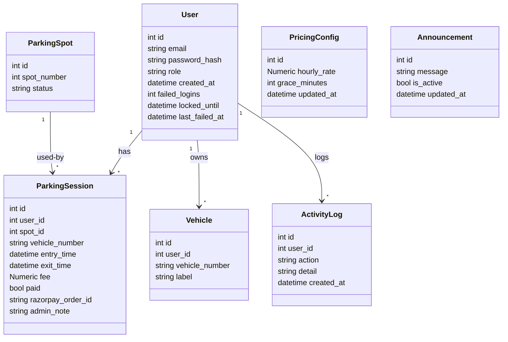
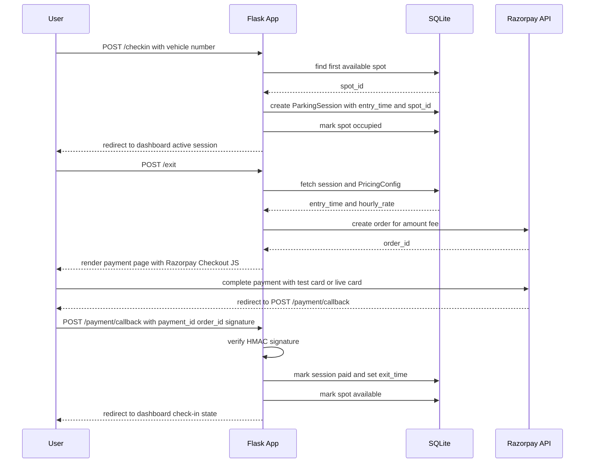
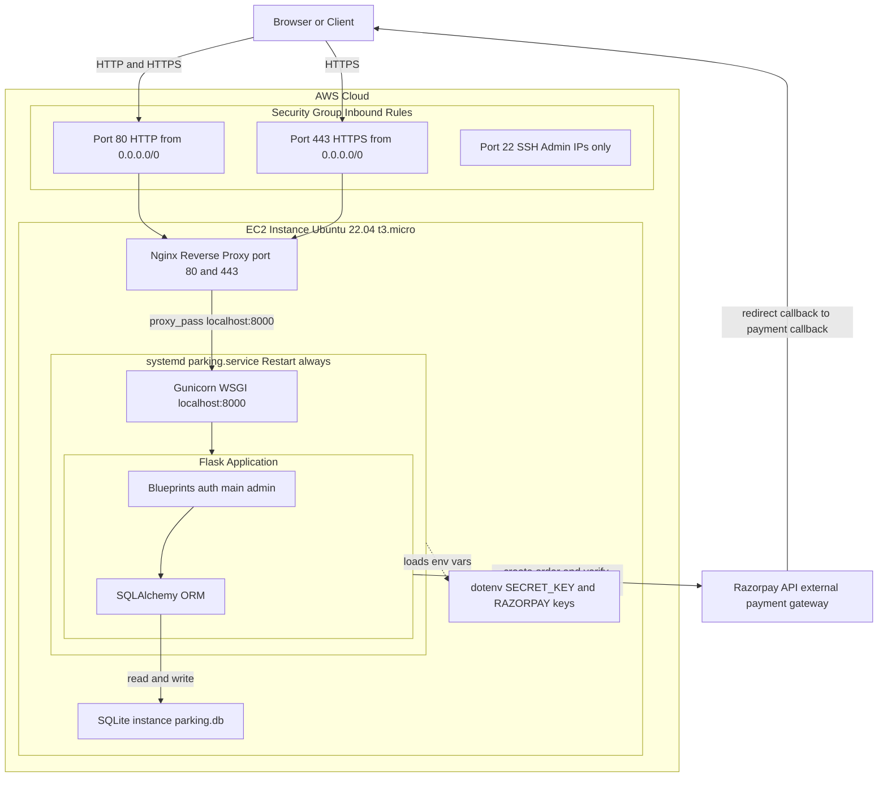
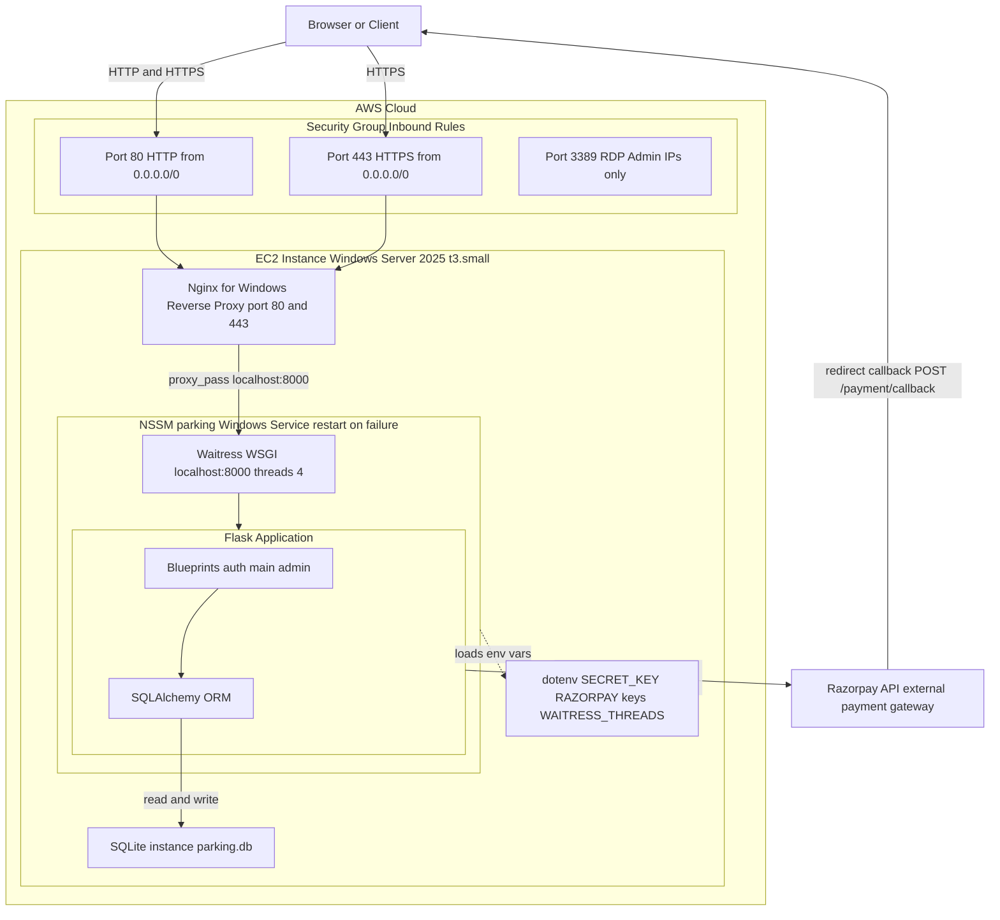

# Local Setup Guide — ParkEasy

## Quick start (macOS / Linux)

```bash
git clone <repo-url> park-easy
cd park-easy
cp .env.example .env     # then edit .env — see step 2 below
make start               # creates venv, installs deps, migrates DB, seeds admin, starts dev server
```

App starts at **http://localhost:5000**

### Step 1 — Clone and enter the directory

```bash
git clone <repo-url> park-easy
cd park-easy
```

### Step 2 — Fill in `.env`

`make setup` copies `.env.example` → `.env`. Open `.env` and set:

| Variable | What to put |
|---|---|
| `SECRET_KEY` | Any long random string (auto-filled with a placeholder by `make setup`) |
| `RAZORPAY_KEY_ID` | Test-mode key ID — see instructions below |
| `RAZORPAY_KEY_SECRET` | Test-mode key secret — see instructions below |
| `ADMIN_EMAIL` | Email for the seeded admin account |
| `ADMIN_PASSWORD` | Password for the seeded admin account |
| `SQLALCHEMY_DATABASE_URI` | Leave blank for SQLite (default) |

### Razorpay test-mode keys

Razorpay keys are only needed if you want to test the full **Exit & Pay** flow. You can skip this and still test registration, login, check-in, and the entire admin panel — those work with the placeholder values already in `.env`.

**To generate test-mode keys:**

1. Sign up or log in at `dashboard.razorpay.com`
2. Make sure the toggle in the top-left says **Test Mode** (not Live Mode)
3. Go to **Settings → API Keys**
4. Click **Generate Test Key**
5. Copy both values immediately — the secret is only shown once:
   - **Key ID** — looks like `rzp_test_AbCdEfGhIj1234`
   - **Key Secret** — a random alphanumeric string
6. Paste them into `.env`:
   ```
   RAZORPAY_KEY_ID=rzp_test_AbCdEfGhIj1234
   RAZORPAY_KEY_SECRET=your_secret_here
   ```

In the Razorpay checkout modal, use one of these test cards to simulate a successful payment:

**Visa (recommended):**
| Field | Value |
|---|---|
| Card number | `4718 6009 0281 8477` |
| Expiry | Any future date |
| CVV | Any 3 digits |
| OTP (if prompted) | `1234` |

**Mastercard:**
| Field | Value |
|---|---|
| Card number | `5267 3181 8797 5449` |
| Expiry | Any future date |
| CVV | Any 3 digits |
| OTP (if prompted) | `1234` |

> **Note:** Generic Visa test cards like `4111 1111 1111 1111` will fail with "International cards are not supported" — always use the Razorpay-specific cards above.

> **Skipping Razorpay locally:** Leave the placeholder values (`test-key-id` / `test-key-secret`) in `.env`. The app starts fine — only the Exit & Pay step will show a "Payment initiation failed" flash and return you to the dashboard. All other features work normally.

### Step 3 — `make start`

```bash
make start
```

This single command:
1. Creates a Python virtualenv (`venv/`)
2. Installs all dependencies from `requirements.txt`
3. Runs `flask db upgrade` to create / migrate the schema
4. Seeds the admin user and 10 parking spots
5. Starts the Flask development server on port 5000

### Step 4 — Subsequent runs

After the first-time setup, just:

```bash
source venv/bin/activate
make run
```

---

## End-to-end test checklist

Use this to verify all flows work correctly with Razorpay test mode.

**User flow:**
1. Go to http://localhost:5000/auth/register — register a new user
2. Log in as that user
3. Enter a vehicle number and click **Check In** — dashboard should show active session
4. Click **Exit & Pay** — fee breakdown shown
5. Click **Pay ₹X** — Razorpay modal opens (test mode)
6. Use Razorpay test card: **4718 6009 0281 8477**, any future expiry, any CVV, OTP `1234`
7. Payment succeeds → redirected to dashboard (check-in form shown again)
8. Session row should have `paid=True`, `exit_time` set, spot status back to `available`

**Admin flow:**
1. Log in with the admin credentials you seeded
2. Go to **Admin Panel → Manage Spots** — add / deactivate spots
3. Go to **Admin Panel → View Sessions** — the test session from above appears
4. Go to **Admin Panel → Update Pricing** — change hourly rate, then repeat user flow to verify new rate applies

**Tests:**
```bash
make test          # runs pytest --cov=app
```

---

## Architecture

### Data Model (Class / ER Diagram)



*Class / ER Diagram — `status` values: available | occupied | inactive; `role` values: user | admin. `PricingConfig` and `Announcement` are standalone singleton/admin-managed tables.*

---

### Payment Sequence (Check-in → Exit → Razorpay → Callback)



*Payment Sequence — the fee is calculated and persisted on the `ParkingSession` row at `exit()` time. `payment_callback()` reads the stored fee rather than recalculating, ensuring the amount stored exactly matches the amount charged via Razorpay.*

---

### Deployment Architecture — Linux (Ubuntu 22.04)



*Linux Deployment Architecture — single EC2 instance with Nginx reverse proxy, Gunicorn WSGI server, and systemd process manager.*

---

### Deployment Architecture — Windows (Windows Server 2025)

Gunicorn is Unix-only and cannot run on Windows Server. The Windows path replaces **Gunicorn** with **Waitress** and **systemd** with **NSSM**; everything else (Flask, SQLAlchemy, Razorpay, Nginx) is identical.



*Windows Deployment Architecture — single EC2 instance with Nginx reverse proxy, Waitress WSGI server, and NSSM Windows Service manager. This is the validated deployment path (screenshots 40–45).*

---

## Windows

### Option A — WSL (recommended)

Enable WSL in PowerShell (run as Administrator):

```powershell
wsl --install
```

Install Ubuntu from the Microsoft Store, then follow the macOS/Linux steps above inside the WSL terminal — everything works identically.

### Option B — Git Bash + make

1. Install [Git for Windows](https://git-scm.com/download/win) (includes Git Bash)
2. Install `make`:
   ```powershell
   winget install GnuWin32.Make
   ```
   Or with Chocolatey: `choco install make`
3. Open Git Bash and run the same `make` targets as on macOS/Linux

### Option C — PowerShell / Command Prompt (no extra tooling)

```powershell
python -m venv venv
venv\Scripts\activate
pip install -r requirements.txt
copy .env.example .env        # then open .env and fill in values
flask db upgrade
flask seed-admin              # prompts for admin email + password
flask seed-spots 10           # seeds 10 parking spots
flask run                     # starts at http://localhost:5000
```

Subsequent runs:
```powershell
venv\Scripts\activate
flask run
```

> Note: `gunicorn` is Linux/macOS only — always use `flask run` for local development on Windows.

---

## EC2 Deployment (Windows Server)

The app runs on Windows Server EC2 using **Waitress** (WSGI server) + **Nginx** (reverse proxy) + **NSSM** (Windows service manager).

### Which script to use?

| | `setup_windows.ps1` | `userdata_windows.ps1` |
|---|---|---|
| **How it runs** | You RDP in and run it manually | Runs automatically on EC2 first boot (User Data) |
| **`.env` / secrets** | You copy the file manually to the server | Pulled automatically from AWS SSM Parameter Store |
| **AWS knowledge needed** | None | IAM role + SSM parameter (one-time setup) |
| **Best for** | Learning, quick testing, re-deploys | Production / repeatable zero-touch launches |
| **Re-deploy** | Run again — does `git pull` + restart | Not designed for re-deploy (User Data runs once) |

---

### Option A — Automated (setup_windows.ps1)

This script is idempotent — safe to run on first deploy and every re-deploy.

**First-time deploy on a fresh EC2:**

1. RDP into the EC2 instance
2. Copy `deploy\setup_windows.ps1` to the EC2 (e.g. to `C:\Users\Administrator\Downloads\`)
3. Create a `.env` file with your production secrets (see `.env` variables table above) — place it anywhere for now
4. Open PowerShell **as Administrator** and run:

```powershell
Set-ExecutionPolicy Bypass -Scope Process -Force
.\setup_windows.ps1 -RepoUrl "https://github.com/your-username/your-repo.git" -AppDir "C:\park-easy"
```

The script will:
- Install Chocolatey, Python, Git, Nginx, NSSM
- Clone the repo into `C:\park-easy`
- Create a virtualenv and install dependencies
- **Pause at Step 5** — copy your `.env` file to `C:\park-easy\.env` then press any key to continue
- Run `flask db upgrade`, seed admin + pricing + 10 spots
- Register Waitress as a Windows service (`parking`) via NSSM
- Write a clean Nginx config and register Nginx as a Windows service
- Open firewall rules for ports 80 and 443

5. In the AWS Console → EC2 → Security Groups: add an inbound rule for **HTTP (port 80)** from `0.0.0.0/0`
6. Visit `http://<ec2-public-ip>` in a browser

> EC2 public IP changes on every instance restart unless you attach an Elastic IP.

**Re-deploy after code changes (already set up EC2):**

```powershell
cd C:\park-easy\deploy
.\setup_windows.ps1
```

No arguments needed — script detects the existing repo and does `git pull` + restarts the service.

---

### Option B — Fully automated via EC2 User Data (userdata_windows.ps1)

No RDP needed. The script runs on first boot and sets up everything — including pulling your `.env` from AWS SSM Parameter Store.

**One-time prerequisites (done from your local machine):**

1. **Store your `.env` in SSM Parameter Store:**

```powershell
# From your local machine with AWS CLI configured
aws ssm put-parameter `
  --name "/parkeasy/env" `
  --type "SecureString" `
  --value (Get-Content .env -Raw) `
  --overwrite
```

2. **Store your GitHub token in SSM** (only needed for private repos):

```powershell
aws ssm put-parameter `
  --name "/parkeasy/github_token" `
  --type "SecureString" `
  --value "ghp_your_token_here" `
  --overwrite
```

3. **Create an IAM role** with `AmazonSSMReadOnlyAccess` and attach it to the EC2 instance at launch.

4. **Edit `deploy\userdata_windows.ps1`** — set `$RepoUrl` to your repo URL (and optionally `$AppDir`).

**Launch EC2 with the script as User Data:**

```powershell
# From your local machine
$userData = Get-Content "deploy\userdata_windows.ps1" -Raw
$b64 = [Convert]::ToBase64String([System.Text.Encoding]::UTF8.GetBytes($userData))

aws ec2 run-instances `
  --image-id <windows-ami-id> `
  --instance-type t3.small `
  --key-name <your-key-pair> `
  --security-group-ids <sg-id-with-port-80-open> `
  --iam-instance-profile Name=<profile-with-ssm-access> `
  --user-data $b64
```

The instance will boot and fully configure itself (~5–10 minutes). Monitor progress by RDPing in and tailing:

```powershell
Get-Content C:\userdata_bootstrap.log -Tail 30 -Wait
```

When you see `=== Bootstrap complete ===`, visit `http://<ec2-public-ip>`.

> User Data runs **once** on first boot. For re-deploys, RDP in and use `setup_windows.ps1` instead.

---

### Option C — Manual deployment (step by step)

Use this if you want full control or the script fails partway through.

**1. Launch EC2**
- AMI: Windows Server 2022 or 2025
- Instance type: `t3.micro` (free tier) or larger
- Security group: allow inbound **RDP (3389)** from your IP, **HTTP (80)** from anywhere

**2. Connect via RDP and open PowerShell as Administrator**

**3. Install dependencies**

```powershell
Set-ExecutionPolicy Bypass -Scope Process -Force
[Net.ServicePointManager]::SecurityProtocol = [Net.SecurityProtocolType]::Tls12
Invoke-Expression ((New-Object Net.WebClient).DownloadString('https://community.chocolatey.org/install.ps1'))
choco install python git nginx nssm -y --no-progress
$env:Path = [System.Environment]::GetEnvironmentVariable("Path","Machine") + ";" + [System.Environment]::GetEnvironmentVariable("Path","User")
```

**4. Clone repo and set up Python environment**

```powershell
git clone https://github.com/your-username/your-repo.git C:\park-easy
cd C:\park-easy
python -m venv venv
venv\Scripts\pip install --upgrade pip
venv\Scripts\pip install -r requirements.txt
```

**5. Create `.env`**

Create `C:\park-easy\.env` with these values:

```
FLASK_ENV=production
SECRET_KEY=<long random string — run: python -c "import secrets; print(secrets.token_hex(32))">
RAZORPAY_KEY_ID=rzp_test_...
RAZORPAY_KEY_SECRET=...
ADMIN_EMAIL=admin@example.com
ADMIN_PASSWORD=yourpassword
WAITRESS_THREADS=4
```

**6. Run migrations and seed data**

```powershell
cd C:\park-easy
$env:FLASK_APP = "run.py"
venv\Scripts\python -m flask --app run:app db upgrade
venv\Scripts\python -m flask --app run:app seed-admin
venv\Scripts\python -m flask --app run:app seed-pricing
venv\Scripts\python -m flask --app run:app seed-spots 10
```

**7. Register Waitress as a Windows service via NSSM**

```powershell
$nssm = "C:\ProgramData\chocolatey\bin\nssm.exe"
& $nssm install parking C:\park-easy\venv\Scripts\python.exe C:\park-easy\wsgi_windows.py
& $nssm set parking AppDirectory C:\park-easy
& $nssm set parking AppEnvironmentExtra "FLASK_ENV=production"
& $nssm set parking Start SERVICE_AUTO_START
New-Item -ItemType Directory -Force C:\park-easy\logs
& $nssm set parking AppStdout C:\park-easy\logs\service_stdout.log
& $nssm set parking AppStderr C:\park-easy\logs\service_stderr.log
& $nssm start parking
```

Verify: `nssm status parking` should show `SERVICE_RUNNING`

**8. Configure Nginx**

Find the nginx root (versioned folder under `C:\tools`):

```powershell
$nginxRoot = (Get-ChildItem "C:\tools" -Directory -Filter "nginx*" | Sort-Object Name -Descending | Select-Object -First 1).FullName
```

Create the sites directory and copy the parking config:

```powershell
New-Item -ItemType Directory -Force "$nginxRoot\conf\sites"
Copy-Item C:\park-easy\deploy\nginx_windows.conf "$nginxRoot\conf\sites\parking.conf"
```

Replace `$nginxRoot\conf\nginx.conf` with a clean config (overwrite the default):

```powershell
@"
worker_processes 1;
events { worker_connections 1024; }
http {
    include       mime.types;
    default_type  application/octet-stream;
    sendfile      on;
    keepalive_timeout 65;
    include sites/*.conf;
}
"@ | Set-Content "$nginxRoot\conf\nginx.conf" -Encoding UTF8
```

Register and start Nginx as a service:

```powershell
$nssm = "C:\ProgramData\chocolatey\bin\nssm.exe"
& $nssm install nginx "$nginxRoot\nginx.exe" "-p `"$nginxRoot`""
& $nssm set nginx AppDirectory $nginxRoot
& $nssm set nginx Start SERVICE_AUTO_START
Start-Service nginx
```

**9. Open Windows Firewall**

```powershell
New-NetFirewallRule -DisplayName "ParkEasy-HTTP" -Direction Inbound -Protocol TCP -LocalPort 80 -Action Allow
```

**10. Test**

Visit `http://<ec2-public-ip>` — you should see the ParkEasy login page.

---

### End-to-end test on EC2

1. Open `http://<ec2-public-ip>/auth/register` — register a user
2. Log in → **Check In** with a vehicle number (e.g. `KA05HM5624`)
3. Dashboard shows active session with live fee estimator
4. Click **Exit & Pay** → fee shown
5. Click **Pay ₹X** → Razorpay modal (test mode)
6. Use test card: `4718 6009 0281 8477`, any future expiry, any CVV, OTP `1234`
7. After payment → redirected to dashboard showing check-in form (spot freed)
8. Log in as admin (`ADMIN_EMAIL` / `ADMIN_PASSWORD`) → verify session appears in Admin → Sessions with `paid = True`

**Useful service commands:**

```powershell
nssm status parking          # check app service
nssm restart parking         # restart after code change
nssm status nginx            # check nginx service
Restart-Service nginx        # restart nginx

# View live logs
Get-Content C:\park-easy\logs\service_stderr.log -Tail 50 -Wait
```

